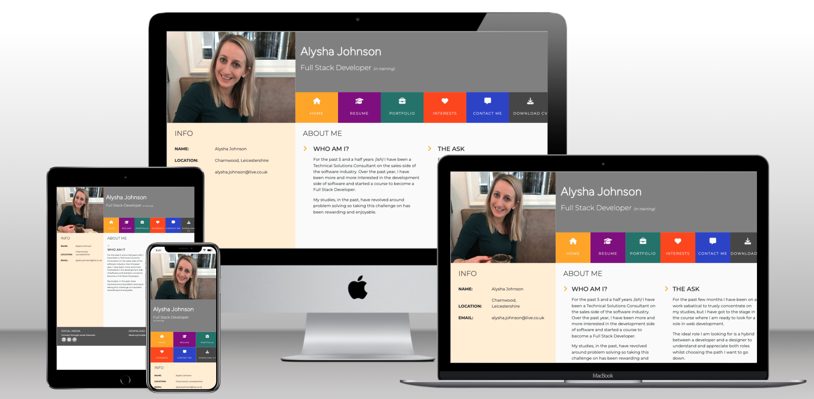
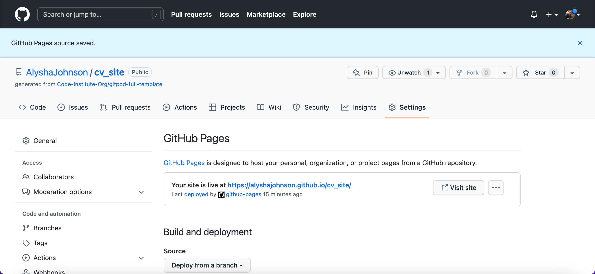

# My CV

Purpose:

Aim:

The live link can be found here - https://alyshajohnson.github.io/cv_site/

## 1. Design and Development

This project was part of an activity through codeinstitute to make an online CV using bootstrap, therefore the standard use of the 5 pillar model has not been used. However, some elements were used to enhance the project and make it tailored to the individual it is intended for (i.e. ME!).

### 1.1 Skeleton

Some skeleton models were drawn up to understand the layout of the grid system in bootstrap.

## 2. Technologies used

Several technologies were used to aid the project:

- [HTML](https://developer.mozilla.org/en-US/docs/Web/HTML)
- Used as the basic building block for the project and to structure the content.
- [CSS](https://developer.mozilla.org/en-US/docs/Learn/Getting_started_with_the_web/CSS_basics)
- Used to style all the web content across the project. 
- [Google Fonts](https://fonts.google.com/)
- Used to obtain the fonts in website
- [Font Awesome](https://fontawesome.com/)
- Used to obtain the icons used throughout website.
- [GitHub](https://github.com/)
- Used to store code for the project after being pushed.
- [Git](https://git-scm.com/)
- Used for version control by utilising the Gitpod terminal to commit to Git and Push to GitHub.
- [Gitpod](https://www.gitpod.io/)
- Used as the development environment.
- [Colormind](http://colormind.io/)
- Used to determine colour palette throughout website.
- [Tiny.png](https://tinypng.com/)
- Used to compress my images so that the page would load faster.
- [Techsini](http://techsini.com/multi-mockup/index.php)
- Used to generate multi-device mockup.
- [Freeformatter CSS Beautify](https://www.freeformatter.com/css-beautifier.html)
- Used to accurately format CSS code.
- [Freeformatter HTML Formatter](https://www.freeformatter.com/html-formatter.html)
- Used to accurately format HTML code.
- [Python](https://www.python.org/)
- Python is the core programming language used to write all of the code in this game to make it fully functional.

## 3. Features

### 3.1 Existing Features

The features deployed for this quiz are as follows:

<insert feature descriptions and images>

### 3.2 Future Features

In addition to the features deployed, some features that could be deployed in a future release are:
- <list future features>

## 4. Testing

### 4.1 Initial Developer Testing

As the project was developed and coded, developer testing was conducted to reduce the impact of bugs and errors in the code. This testing consisted of general debugging of written code based off gitpod IDE recommendations; running through input validator testing scenarios to check for input errors; and testing on different browsers.

**General Debugging**

**Input Validator Testing**

**Browser / Device testing**

The development of this app was conducted on Google Chrome, therefore extensive testing was conducted on this browser. This was used as a benchmark against Firefox and Safari.

The elements of testing conducted on each browser are:
<insert list of testing performed and why - see example below>
- User Experience - what does the quiz look like; is the flow through the quiz the same; are all elements where they are expected?
- Functionality - do the buttons work as expected; does the question counter count?
- Performance - how responsive is the site?

The user experience is consistent on Chrome, Firefox and Safari. The instruction videos in Safari do not load - this bug has been captured.

Responsive design is important, CSS code had to be amended and adjusted to make sure the app could work on a number of devices. There were a number of user experience bugs that were produced when testing. These have now been fixed in the code.

### 4.2 Validator Testing

Using tools such as W3C validator, Jigsaw and Lighthouse gives visibility of any code, scripts or elements that are causing any errors. The results for the site are as follows:

**HTML**
- <insert report number> errors were returned when passing through the official [W3C validator](<insert link to report>)

**CSS**
- <insert report number> errors were found when passing through the official [(Jigsaw) validator](<insert link to report>)

**JS**
- [JSHint](https://jshint.com/) was used to check for errors in the JS code.
- For script.js, there were <insert report number> errors and <insert report number> warnings.
- For instructions.js, there were <insert report number> errors and <insert report number> warnings.
<insert any methods used to reduce number of errors and warnings>

**Performance**
- Results can be seen through the official [Lighthouse](<insert link to report>) report.

As part of the performance test through Lighthouse, some changes were made:
- Accessibility (aria-label) tags were implemented on all buttons to improve the score from 82 to 100.
- The cache policy was amended to increase the length of number of seconds the browser should cache the resource.
- The image file sizes needed to be compressed so reduce the impact on performance. This was successfully done using [tinyPNG](https://tinypng.com/).

### 4.3 User Testing
This app has been tested by a small group of 10 users in which some feedback was captured in the design and some errors in functionality and spelling were corrected.

UI improvements made:
- <list any improvements to UI that were made here>

Errors / bug fixes:
- <list errors/bugs that were found, what the problem was and how they were fixed>

### 4.4 Unfixed Bugs

- <list unfixed bugs here>

## 5. Deployment

This website was deployed using GitPages and following the below steps:

GitHub pages deployment
1. Log in to GitHub
2. In the Repository section, select the project repository that you want to deploy
3. In the menu located at the top of this section, click 'Settings'
4. Select 'Pages' on the left-hand menu - this is around halfway down
5. In the source section, select branch 'Master' and save
6. The page is then given a site URL which will be seen above the source section, it will look like the following:

Please note it can take a while for this link to become fully active.

Forking the GitHub Repository
To make changes to this repository without affecting it, a copy can be made by 'Forking' it. This ensures the original repository remains unchanged.
1. Find the relevant GitHub repository
2. In the top right corner of the page, click the Fork button (under account)
3. The repository has now been 'Forked' and you have a copy to work on

Cloning the GitHub Repository
Cloning a repository will allow a local version of the repository will be downloaded so can be worked on. Cloning is also a great way to backup work.
1. Find the relevant GitHub repository
2. Press the arrow on the Code button
3. Copy the link that is shown in the drop-down
4. Now open Gitpod & select the directory location
5. In the terminal type 'git clone' & then paste the link copied from GitHub
6. Press enter and a local clone will be created.

## 6. Credits

### 6.1 Content

Logos and Fonts:
- The fonts were taken from [GoogleFonts](https://fonts.google.com/)
- The icons in the footer were taken from [Font Awesome](https://fontawesome.com/)

Tutorials and support:
- General guidance, information and limitations on elements, attributes, and methods from [w3schools](https://www.w3schools.com/default.asp) and [MDN Web Docs](https://developer.mozilla.org/en-US/)
- <insert list of tutorials followed>

### 6.2 Media

Any photos used throughout the app are stock imagery from the following services:
- [unsplash](https://unsplash.com/)
- [FreeImages](https://www.freeimages.com/)
- [PikWizard](https://pikwizard.com/)

<insert any other media used throughout the app/site here>

### 6.3 Special Thanks
